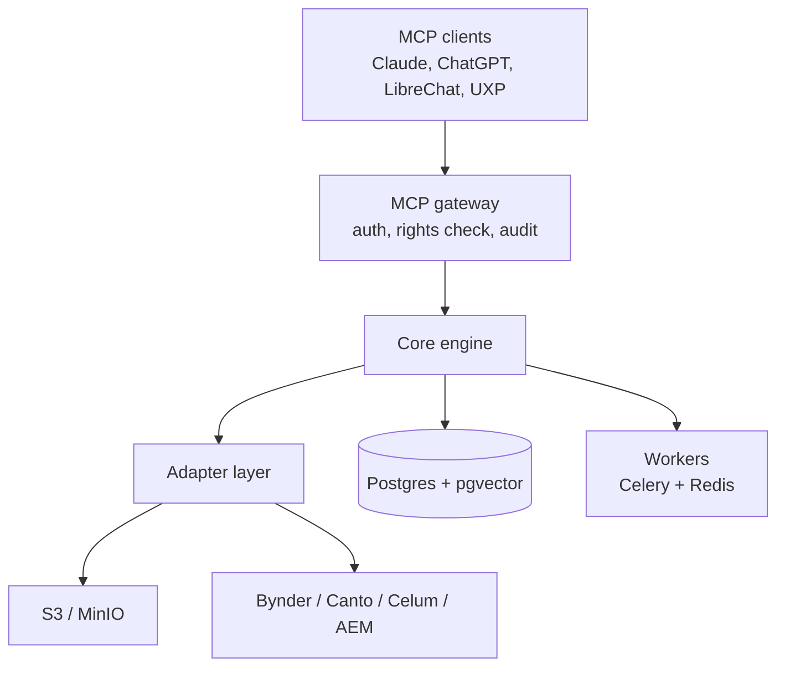
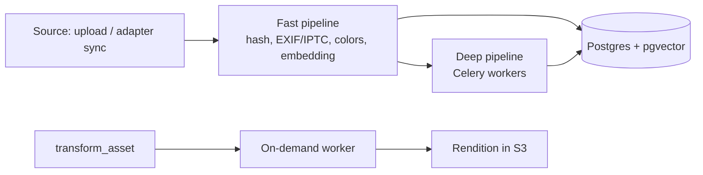

<div align="center">

# OpenAgenticDAM — Core

**The open, rights-aware MCP layer that makes existing media libraries agent-ready — without migration.**

[](#project-status)
[](LICENSE)
[](https://modelcontextprotocol.io)
[](https://www.python.org/)

</div>

> **Project status: pre-alpha — specification only.**
> This repository currently contains no runnable code. The product requirements are written,
> the architecture is decided, implementation of `v0.1` has not started.
> Nothing below is a claim about shipped functionality; it describes what is being built.
> Watch the repo or open an issue if you want to help shape it.

---

## Why this exists

Enterprises keep their media assets in several places at once: one or more commercial DAMs,
S3 buckets, agency storage. Search only works as well as the manually maintained tags, and
AI agents have no rights-compliant way in at all.

DAM vendors are adding AI — but each one only inside its own system. Cross-system search,
self-hosting and vendor-neutral agent access run against their lock-in model.
Migrating everything into one system is expensive, risky and takes years.

**The missing piece is a neutral access layer between AI agents and distributed media
repositories.** That is what OpenAgenticDAM is.

## What it does

OpenAgenticDAM exposes your media — wherever it lives — as typed
[MCP](https://modelcontextprotocol.io) tools. You search, inspect and (later) transform assets in
natural language from Claude Desktop, ChatGPT, LibreChat or any other MCP client.

Two operating modes:

| Mode | What it is | Who it's for |
| --- | --- | --- |
| **Overlay** (core product) | Sits in front of S3/MinIO and commercial DAMs (Bynder, Canto, Celum, AEM). Originals stay in the source system; only metadata, embeddings and thumbnails are indexed. | Enterprises with an existing DAM landscape |
| **Standalone** | Full DAM with its own storage | Developers and self-hosters getting started |

There is **no web dashboard** — by design. Previews and reviews render as image responses and
MCP apps inside the client you already use.

## Product principles

1. **Adapter-first** — nobody has to migrate. Every feature works against source systems through one adapter layer.
2. **Chat-first, no dashboard** — every capability is a typed, deterministic MCP tool.
3. **Rights before relevance** — never a search hit the user could not see in the source system. Fail closed.
4. **The LLM decides, workers execute** — the model picks tool and parameters; libvips, FFmpeg and Trimesh do the deterministic work.
5. **Local-first on cost** — routine work on local models, cloud APIs only for hard cases.
6. **Compliance is core, not an add-on** — audit log, AI labelling and C2PA content credentials live in the open core.

## MCP tools

Nine tools cover the asset lifecycle. Three form the MVP. Write tools support `dry_run` and
require explicit confirmation for destructive operations.

| Tool | Purpose | Phase |
| --- | --- | --- |
| `search_assets` | Hybrid keyword/semantic search across all sources, rights-filtered, thumbnails as image responses | MVP |
| `get_asset_details` | EXIF, rights, AI captions, OCR, transcript, deep link into the source system | MVP |
| `list_sources` | Connected source systems and sync status | MVP |
| `request_upload` | Pre-signed URL for direct upload | v0.3 |
| `upload_asset_via_url` | Ingest an asset from a web source | v0.3 |
| `edit_asset_metadata` | Change metadata, with audit entry | v0.3 |
| `transform_asset` | Scale, crop, convert, trim, watermark → new rendition | v0.3 |
| `manage_collections` | Create and maintain collections | v0.4 |
| `label_ai_content` | AI labelling and C2PA manifest | v0.4 |

All tools: typed JSON schemas, stable error codes, pagination, bounded response size.
Assets are never returned as full files — only thumbnails or pre-signed URLs.

## Architecture



| Component | Choice | Why |
| --- | --- | --- |
| Language / API | Python 3.11+, FastAPI, official MCP Python SDK | mature SDK, native ML and media libraries |
| Transport | MCP over stdio (local) and Streamable HTTP (server) | desktop clients and remote operation |
| Database | PostgreSQL + pgvector | relations, rights and vectors in one system |
| Storage | S3-compatible (MinIO, AWS S3) | pre-signed URLs instead of streaming through the server |
| Queue | Celery + Redis | established, scales horizontally |
| LLM routing | Ollama local, cloud APIs as fallback | near-zero marginal cost for routine tasks |
| Packaging | uv, Docker Compose, Helm chart later | fast local start, Kubernetes for enterprise |

### Ingestion

Every asset runs through a **fast pipeline** (target < 3 s per image) for searchability and an
asynchronous **deep pipeline** for content understanding.



| Medium | Deep analysis | On-demand processing | Stack |
| --- | --- | --- | --- |
| Images | OCR, captioning, VLM analysis | smart crop, scaling, WebP/CMYK, watermark | PaddleOCR, local VLM, libvips, Pillow |
| Video | scene detection, keyframe embeddings, transcription | stream-copy trim, H.264/WebM, burned-in subtitles | PySceneDetect, faster-whisper, FFmpeg |
| 3D | offscreen rendering, mesh checks | decimation, STL → glTF | Trimesh, Open3D, PyOpenGL |
| Documents | text extraction, page thumbnails | — | pypdf / pdfplumber |

## Security, rights & compliance

Rights enforcement in overlay mode is the single most important requirement: semantic search
must never surface more than the source system would.

- **ACL mirroring** — permissions are synced per asset and applied as an SQL filter *before* vector ranking. Unclear rights mean the asset is invisible (fail closed).
- **Identity** — users authenticate at the gateway via OAuth and are mapped to source-system principals.
- **Prompt injection** — OCR text, captions and transcripts are foreign content. They are marked as data in tool responses, never phrased as instructions to the model.
- **Destructive actions** — `dry_run` plus explicit confirmation for delete, overwrite and bulk changes.
- **Audit log** — every tool call with user, client, parameters and affected assets. Part of the open core, not an enterprise upsell.
- **AI labelling** — detect and label AI-generated assets, read and write C2PA manifests (EU AI Act Art. 50).
- **Privacy** — local-first models by default; cloud APIs opt-in per tenant.
- **Secrets** — environment variables or a secret store only. No default credentials in example configs.

## Roadmap

| Version | Content | Exit criterion |
| --- | --- | --- |
| **v0.1** | MCP gateway, data model, S3/MinIO adapter, fast ingestion, `search_assets`, `get_asset_details`, audit log | search across 100k test assets from Claude Desktop |
| **v0.2** | first commercial DAM adapter with ACL sync, `list_sources`, thumbnail responses | customer pilot, zero rights violations in testing |
| **v0.3** | deep pipeline (OCR, captions, video, Whisper), write tools with `dry_run` | Recall@10 measurably better than the source system's tag search |
| **v0.4** | AI labelling / C2PA, collections, 3D pipeline, second DAM adapter | one compliance workflow live in a pilot |
| **v0.5** | SSO/SAML, granular RBAC, multi-tenancy, Helm chart | first paying enterprise customer |
| **v1.0** | managed cloud, UXP panel (subject to market validation) | stable per-asset pricing |

Timelines are deliberately omitted until team and capacity are fixed.

### Non-goals

- No web dashboard
- No replacement for DAM workflows (approval chains, brand portals, PIM)
- No generative image creation
- No write-back into source DAMs in the MVP

## Getting started

> Not available yet — `v0.1` is unimplemented. The intended flow once it lands:

```bash
git clone https://github.com/OpenAgenticDAM/Core.git
cd Core
docker compose up -d        # Postgres + pgvector, Redis, MinIO
uv sync
alembic upgrade head
# start worker + MCP server, then register the server in claude_desktop_config.json
```

Hardware guidance: CPU-only operation is supported (CPU embeddings, reduced deep pipeline).
A GPU worker with 20–24 GB VRAM is recommended for the deep pipeline. For datacenter
deployments plan for workstation or datacenter GPUs — NVIDIA's driver licence restricts
GeForce cards there.

## Non-functional targets

Targets for the MVP. These are assumptions and will be calibrated in the first pilot.

| Area | Target |
| --- | --- |
| Search latency | p95 < 800 ms at 1M assets per tenant |
| Fast ingestion | < 3 s per image, ≥ 50,000 images/hour on one GPU worker |
| Scale | 10M assets per installation, horizontally scaling workers |
| Sync freshness | rights and deletion changes visible ≤ 15 min |
| Availability | 99.5 % (managed cloud), no SLA when self-hosted |
| Observability | OpenTelemetry traces per tool call, Prometheus metrics |

## Open core

Everything in this repository is Apache 2.0 and self-hostable: gateway, core engine,
S3/MinIO adapter, ingestion, search, audit log.

Commercial offerings are built on the same code base and carry the same brand
(*OpenAgenticDAM Enterprise*, *OpenAgenticDAM Cloud*): commercial DAM adapters, SSO/SAML,
granular RBAC, multi-tenancy, compliance reporting and support SLAs. The base audit log
stays open source — what is sold is evaluation and assurance for auditors.

## Documentation

- [Product Requirements Document](docs/PRD.md) — full spec: problem, market, scope, tools, data model, security, roadmap, business model
- [PRD (German original)](docs/PRD.de.md) — authoritative source version

## Contributing

Early days: the highest-value contributions right now are **problem validation** and
**adapter design**. If you run a multi-DAM landscape, open an issue and tell us what breaks
today — that feedback outranks code at this stage.

Once `v0.1` lands, adapters are the natural entry point for contributors: one adapter
interface, one source system, clear tests for rights mirroring.

## License

[Apache License 2.0](LICENSE)

---

<div align="center">
<sub>OpenAgenticDAM · speech as the interface to every asset, in every system, rights-compliant, without migration.</sub>
</div>
