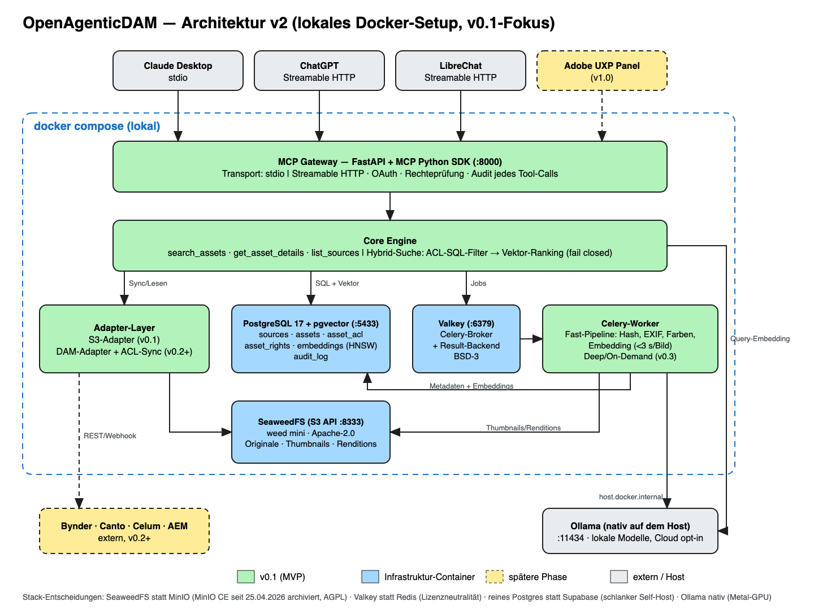

# Architecture & local setup

Status: **v0.1 base, runs locally**. This document describes what is actually implemented
in this repository, how to run it, and where it deliberately deviates from the
[PRD](PRD.md). Diagram: [`architecture.excalidraw`](architecture.excalidraw) (PNG/SVG
alongside).



## Components

| Component | Implementation | Port (host, 127.0.0.1 only) | License |
| --- | --- | --- | --- |
| MCP gateway | `openagenticdam serve` — MCP Python SDK 2.x (`MCPServer`), Streamable HTTP or stdio | 8000 (`/mcp`, `/healthz`) | Apache-2.0 |
| Core engine | `search.py`, `server.py` — rights-filtered pgvector search, audit | – | Apache-2.0 |
| Adapter layer | S3 adapter (`ingest.py`, boto3) | – | Apache-2.0 |
| Database | PostgreSQL 17 + pgvector 0.8.7 (`pgvector/pgvector:0.8.7-pg17`) | 5433 | PostgreSQL |
| Queue | Valkey 8.1 (Celery broker + result backend) | 6379 | BSD-3 |
| Worker | Celery 5.6 (`openagenticdam.worker`) | – | BSD-3 |
| Object storage | SeaweedFS 4.48, single-process `weed mini` (S3 API) | 8333 | Apache-2.0 |
| Embeddings | Ollama **on the host**, `nomic-embed-text` (768 dim) | 11434 | MIT / Apache-2.0 |

### Stack decisions (vs. PRD v0.9)

| PRD | Here | Why |
| --- | --- | --- |
| MinIO | **SeaweedFS** | MinIO Community Edition is archived (GitHub `minio/minio` read-only since 2026-04-25, last release 2025-10-15, no binaries/images). AGPL would also clash with an Apache-2.0 open core. SeaweedFS: Apache-2.0, actively released, strong with many small files (thumbnails). Code talks plain S3, so the backend stays swappable. |
| Redis | **Valkey** | Redis 8 is tri-licensed incl. AGPL; Valkey (Linux Foundation, BSD-3) is a drop-in for Celery. |
| (Supabase considered) | **plain Postgres** | Supabase self-host is ~11 containers (Studio, GoTrue, PostgREST, Realtime, …). We need Postgres only; rights come from source systems, not from Supabase Auth. |
| Ollama in the stack | **Ollama native on the host** | Docker on macOS has no Metal GPU access. Containers reach it via `host.docker.internal`. |
| FastAPI | MCP SDK's own Starlette app | The SDK ships the HTTP transport; FastAPI adds nothing for three tools yet. |

### Schema decisions (vs. PRD data model)

Migration [`0001_initial_schema.py`](../migrations/versions/0001_initial_schema.py):

- `tenant_id` on **every** table, with composite foreign keys `(tenant_id, asset_id)` — tenant
  isolation never relies on a join being written correctly.
- `asset_acl.source_id`: a principal (`group:marketing`) only means something inside its
  source. Callers hold source-namespaced principals `"<source_id>:<principal>"`.
- Primary keys on `asset_acl` and `asset_rights`; `ON DELETE CASCADE` from `assets`.
- `audit_log.outcome` (`ok`, `denied_or_missing`, `invalid_argument`, `error_embedding`).
- Embedding dimension is fixed per migration (768). Another model with a different
  dimension needs a migration — embeddings are versioned by `model` already.

## Rights model (implemented)

1. The ACL check is part of the SQL `WHERE` clause; pgvector ranks only rows the caller may see.
2. **Fail closed:** an asset with no matching ACL row is invisible. Empty principals see nothing.
3. Tenant filter and ACL filter are independent; either alone blocks cross-tenant leaks.
4. `get_asset_details` returns the **same error** for "missing" and "forbidden" — no existence oracle.
5. Every tool call writes an `audit_log` row (actor, client, tool, params, asset ids, outcome).
6. Text extracted from assets is flagged as untrusted (`untrusted_content_notice`).

Tests: `tests/test_rights.py` (7 cases). Each guard was verified by mutation: removing the
principal filter fails 3 tests, removing the tenant filter fails 1.

## MCP tools (v0.1)

| Tool | Input | Output |
| --- | --- | --- |
| `search_assets` | `query` (1–500 chars), `limit` (1–50) | hits with score + pre-signed thumbnail URL (15 min) |
| `get_asset_details` | `asset_id` | technical metadata (dimensions, EXIF subset, colours), rights, source reference |
| `list_sources` | – | sources with sync status and asset count |

Assets are never returned as files — only pre-signed URLs (PRD: bounded response size).

## Known limitations of this base

- **No authentication yet.** Identity is `OAD_DEV_TENANT` / `OAD_DEV_ACTOR` / `OAD_DEV_PRINCIPALS`
  from `.env`. The gateway is bound to 127.0.0.1. Do not expose it. OAuth is the next milestone.
- **Embeddings are text-only.** `nomic-embed-text` embeds file name, title, tags and colour
  names — not pixels. Image-content search needs a multimodal model (SigLIP-2 class); this is
  the PRD's v0.2 model decision.
- S3 sync is a manual `ingest` command, not webhooks/polling; deletions are not synced yet.
- No OCR, captions, video or 3D (deep pipeline, v0.3).

## Local setup

Prerequisites (macOS, tested on Apple M4, 16 GB):

```bash
brew install colima docker docker-compose docker-buildx
# let the docker CLI find the compose/buildx plugins
echo '{"cliPluginsExtraDirs":["'"$(brew --prefix)"'/lib/docker/cli-plugins"]}' > ~/.docker/config.json
colima start --cpu 4 --memory 4 --disk 20 --vm-type vz --mount-type virtiofs
# Ollama (https://ollama.com) running natively, then:
ollama pull nomic-embed-text
# uv (https://docs.astral.sh/uv/)
```

Run:

```bash
./scripts/init-env.sh        # .env with random credentials (never overwrites)
./scripts/up.sh              # build + start all services, wait until healthy
uv sync
uv run python scripts/smoke.py   # upload 3 demo images, ingest via worker, call all MCP tools
```

Tests (need the stack running; they skip cleanly otherwise):

```bash
uv run pytest -q
uv run ruff check . && uv run mypy src --ignore-missing-imports
```

Connect an MCP client:

- Streamable HTTP: `http://127.0.0.1:8000/mcp`
- Claude Desktop (stdio), in `claude_desktop_config.json`:

```json
{
  "mcpServers": {
    "openagenticdam": {
      "command": "uv",
      "args": ["--directory", "/path/to/Core", "run", "openagenticdam", "serve"]
    }
  }
}
```

Ingest your own files:

```bash
# upload with any S3 tool to http://127.0.0.1:8333, bucket from .env, then:
docker compose exec gateway openagenticdam ingest --prefix my/folder/ --async
```

Stop / reset:

```bash
docker compose down          # keep data
docker compose down -v       # delete Postgres + SeaweedFS volumes
./scripts/reclaim-disk.sh    # return freed disk space to macOS
colima stop                  # release the VM's RAM
```

## Resource requirements

Measured on 2026-10-01 with the running stack (idle after ingest), Apple M4 / 16 GB.

### RAM

| Consumer | Measured |
| --- | --- |
| gateway | 92 MiB |
| worker (Celery, 2 processes) | 182 MiB |
| SeaweedFS | 82 MiB |
| Postgres | 32 MiB |
| Valkey | 4 MiB |
| **Containers total** | **~390 MiB** |
| Colima VM, real host RSS (limit 4 GiB) | ~830 MiB |
| Ollama + `nomic-embed-text` (unloaded after 5 min idle) | ~290 MiB |
| **Total on the host** | **~1.1–1.2 GiB** |

The VM limit of 4 GiB is headroom, not usage. `--memory 2` works for this base; keep 4 for
ingestion bursts and the deep pipeline later. A VLM for captioning (v0.3) adds 4–8 GiB
on the host (Ollama), not in the VM.

### Disk

| Item | Size |
| --- | --- |
| Images: SeaweedFS 687 MB, pgvector 656 MB, app 624 MB, Valkey 62 MB (2.0 GB, shared layers) | 2.0 GB |
| Colima VM (`~/.colima/_lima`: system disk 1.1 GB + data disk 2.1 GB holding the images), after trim | 3.2 GB |
| Host tools (colima, lima, docker CLI + plugins) | 0.2 GB |
| `.venv` (dev) + uv cache | 0.6 GB |
| `nomic-embed-text` | 0.26 GB |
| Data volumes (Postgres + SeaweedFS, demo data) | 0.07 GB |
| **Total** | **~4.3 GB** |

Plan **≥ 10 GB free**. Peak usage is higher than steady state: a rebuild left the VM at
4.8 GB on the host (build cache 0.95 GB + replaced image layers) until trimmed. Colima's disks
are sparse files that never shrink on their own; `./scripts/reclaim-disk.sh` prunes the
build cache and TRIMs the **data disk** (`/mnt/lima-colima` — trimming only `/` frees nothing,
the images live on the second disk). Data grows with assets:
roughly the originals (only in standalone mode) + a 512 px WebP thumbnail (≤ ~60 KB, measured on a
noise image as worst case) + ~3 KB embedding (measured 3,076 bytes) + HNSW index per asset;
100,000 overlay assets ≈ 4–7 GB.
