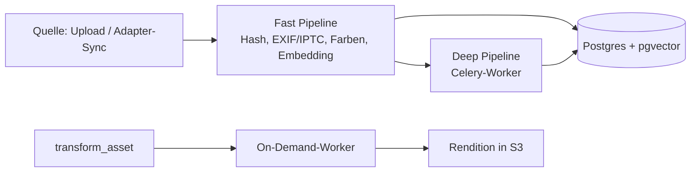
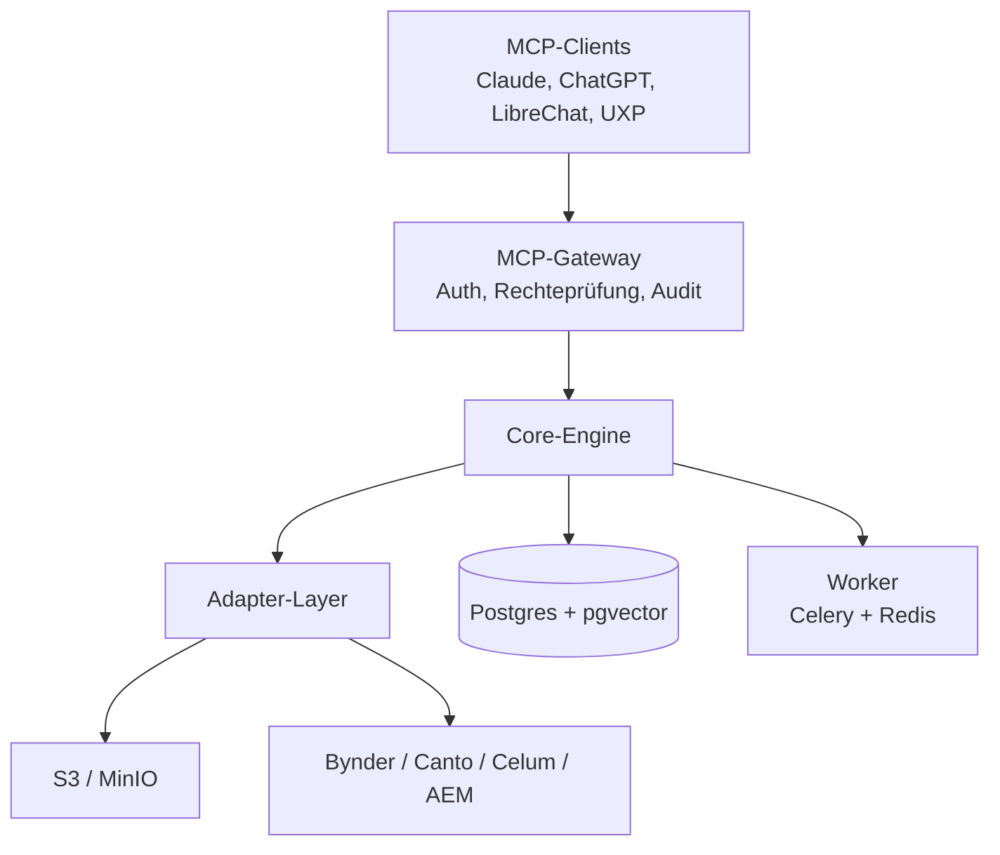

# OpenAgenticDAM — Product Requirements Document

Sep 22, 2026

## Dokument-Status

Entwurf v0.9.

| Feld | Wert |
| --- | --- |
| Projekt | OpenAgenticDAM |
| Repository | [github.com/OpenAgenticDAM](https://github.com/OpenAgenticDAM) |
| Lizenz | Apache 2.0, Open-Core |
| Zielgruppe des Dokuments | Architekten, Entwickler, Enterprise-IT, Marketing-Ops |
| Status | Entwurf, Problemvalidierung ausstehend |

## Executive Summary & Vision

OpenAgenticDAM ist eine quelloffene, rechte-bewusste MCP-Schicht, die Medienbestände in bestehenden Speichern und DAMs per natürlicher Sprache durchsuchbar und bearbeitbar macht, ohne Migration.

Nutzer steuern Suche, Metadaten und Transformationen über MCP-Clients wie Claude Desktop, ChatGPT oder LibreChat. Ein eigenes Web-Dashboard gibt es nicht; eine minimale Review-Ansicht wird über MCP-Apps im Client gerendert.

Das System läuft in zwei Modi: als **Overlay** vor S3/MinIO und kommerziellen DAMs (Bynder, Canto, Celum, AEM) und als **Standalone**-DAM mit eigenem Speicher. Das Overlay ist das Kernprodukt, Standalone der Einstieg für Entwickler.

## Vision, Mission & Warum

**Vision:** Jedes Medien-Asset eines Unternehmens ist für Menschen und KI-Agenten auffindbar und nutzbar, egal in welchem System es liegt. Die Sprache wird zur Oberfläche für alle Medien.

**Mission:** Wir bauen die offene, rechte-bewusste MCP-Schicht, die bestehende Medienbestände ohne Migration agentenfähig macht: selbst hostbar, anbieterneutral und nachweisbar compliant.

**Warum braucht es OpenAgenticDAM? (5× Warum)**

1. **Warum?** Unternehmen finden ihre Assets nicht effizient, und KI-Agenten haben überhaupt keinen Zugriff darauf.
2. **Warum?** Die Assets liegen in Silos (mehrere DAMs, S3, Agenturen), und die Suche hängt an manuell gepflegten Tags, die lückenhaft sind.
3. **Warum lösen das die DAM-Anbieter nicht?** Jeder Anbieter rüstet KI nur im eigenen System nach. Systemübergreifende Suche und offener Agentenzugriff widersprechen ihrem Lock-in-Modell.
4. **Warum nicht einfach alles in ein System migrieren?** Migration ist teuer, riskant und dauert Jahre. Rechte, Workflows und Integrationen hängen an den bestehenden Systemen.
5. **Warum jetzt, und warum offen?** Agenten werden über MCP zur neuen Arbeitsoberfläche. Eine Schicht, die alle Medien eines Unternehmens sieht, braucht maximales Vertrauen: prüfbarer Code, Selbst-Hosting, Rechte-Durchsetzung und Audit. Das liefert glaubwürdig nur Open Source.

**Kernursache:** Es fehlt eine neutrale, vertrauenswürdige Zugriffsschicht zwischen KI-Agenten und den verteilten Medienbeständen. Genau diese Lücke füllt OpenAgenticDAM.

Die Kette beruht auf Annahmen, die in den Kundeninterviews bestätigt werden müssen, vor allem Punkt 3.

## Problem & Zielgruppen

Unternehmen haben Assets über mehrere DAMs und Speicher verteilt, die Suche funktioniert nur über manuell gepflegte Tags, und keine Quelle ist für KI-Agenten erschlossen.

- **Suche scheitert an fehlenden Metadaten:** Bilder ohne Tags oder mit uneinheitlicher Taxonomie sind praktisch unauffindbar.
- **Silos:** Marketing, Produkt und Agenturen arbeiten in verschiedenen Systemen ohne gemeinsame Suche.
- **Agenten ohne Zugang:** LLM-Workflows können Assets nicht rechtekonform finden, prüfen und ausliefern.
- **Compliance-Druck:** KI-generierte Inhalte müssen gekennzeichnet werden (EU AI Act Art. 50), Herkunft muss nachweisbar sein.

| Persona | Rolle | Kernbedarf |
| --- | --- | --- |
| Content-Ops-Manager | pflegt Assets in Enterprise-DAM | systemübergreifende Suche, Metadaten-Anreicherung ohne Handarbeit |
| Enterprise-Architekt | verantwortet DAM-/CSC-Landschaft | KI-Layer ohne Migration, Rechte und Audit sauber |
| Kreativer / Designer | arbeitet in Photoshop, Premiere | Asset finden und passend exportieren, ohne das Tool zu verlassen |
| Entwickler / Self-Hoster | baut eigene Agenten-Workflows | selbst gehostete MCP-Media-Engine mit offener API |

**Offen:** Problem ist noch nicht mit Kunden validiert; Ziel sind 3–5 Interviews vor v0.2.

## Vorteile: Welche Pain Points OpenAgenticDAM beseitigt

OpenAgenticDAM macht bestehende Medienbestände ohne Migration auffindbar, agentenfähig und nachweisbar compliant. Die Wirkungen unten sind Hypothesen und werden im Pilot gemessen.

| Pain Point heute | Lösung durch OpenAgenticDAM | Nutzen |
| --- | --- | --- |
| Assets ohne oder mit schlechten Tags sind unauffindbar | Automatische Embeddings, Captions, OCR und Transkripte bei der Ingestion | Suche nach Bildinhalt statt nach Tags; kein manuelles Nachtaggen |
| Assets liegen verteilt in mehreren DAMs und Speichern | Ein Adapter-Layer, eine Suche über alle Quellen | Eine Anfrage statt Suche in drei Systemen |
| KI-Nachrüstung erfordert Migration ins neue DAM | Overlay vor bestehenden Systemen, Originale bleiben im Quellsystem | Kein Migrationsprojekt, kein Vendor-Wechsel, schneller Start |
| DAM-Oberflächen sind komplex, Gelegenheitsnutzer finden sich nicht zurecht | Bedienung per natürlicher Sprache im gewohnten Chat-Client | Kein Training, Selbstbedienung für Marketing, Vertrieb, Agenturen |
| Varianten (Formate, Größen, Zuschnitte) werden manuell in Photoshop erstellt | `transform_asset` mit deterministischen Workern | Renditions per Satz statt per Ticket an die Grafik |
| Videos sind inhaltlich nicht durchsuchbar | Szenenerkennung, Keyframe-Embeddings, Transkription | Einzelne Szenen und gesprochene Inhalte direkt finden |
| KI-Agenten haben keinen rechtekonformen Zugriff auf Assets | MCP-Tools mit ACL-Durchsetzung aus dem Quellsystem | Agenten-Workflows ohne Rechte- oder Datenleck |
| Nutzungsrechte und Ablaufdaten werden übersehen | Rechte als Suchfilter, Warnung bei abgelaufenen Lizenzen | Weniger Lizenzverstöße und Abmahnrisiko |
| KI-Kennzeichnung (EU AI Act Art. 50) ist manuell und lückenhaft | Erkennung, Kennzeichnung und C2PA-Manifeste im Standard | Nachweisbare Compliance ohne Zusatztool |
| Nachvollziehbarkeit von KI-Änderungen fehlt | Audit-Log jedes Tool-Aufrufs im Open-Core | Revisionssicherheit für IT und Rechtsabteilung |
| Proprietäre KI-Add-ons sind teuer und binden an einen Anbieter | Apache 2.0, selbst hostbar, lokale Modelle | Datenhoheit, keine Pro-Kopf-Lizenzen, Grenzkosten nahe null |
| Kreative wechseln ständig zwischen Tool und DAM | UXP-Panel in Photoshop und Premiere (später) | Asset finden und einsetzen ohne Kontextwechsel |

**Nutzen je Zielgruppe**

- **Content-Ops:** weniger Pflegeaufwand, weil Metadaten automatisch entstehen und über alle Quellen gelten.
- **Enterprise-Architektur:** KI-Fähigkeit für die bestehende DAM-Landschaft ohne Migration, mit Rechte-, Audit- und Compliance-Nachweis.
- **Kreative:** Assets per Satz finden und im benötigten Format erhalten, ohne DAM-Oberfläche.
- **Entwickler:** offene, selbst hostbare Media-Engine als Baustein für eigene Agenten-Workflows.

## Markt & Wettbewerb

Der DAM-Markt wächst stark, aber die großen Anbieter liefern inzwischen eigene KI-Agenten und teils eigene MCP-Server. Die verbleibende Lücke ist die systemübergreifende, selbst gehostete Schicht.

**Marktgröße:** Schätzungen für 2026 liegen zwischen 6,29 und 8,69 Mrd. USD weltweit, bei 15–18 % jährlichem Wachstum; Europa hatte 2025 rund 26 % Anteil ([Fortune Business Insights](https://www.fortunebusinessinsights.com/digital-asset-management-dam-market-104914), [Research and Markets](https://www.researchandmarkets.com/reports/5767251/digital-asset-management-market-report)). Anbieter entwickeln sich laut [Mordor Intelligence](https://www.mordorintelligence.com/industry-reports/digital-asset-management-dam-market) von Speicher-Repositories zu Orchestrierungsschichten; semantische Suche wird zur Grundanforderung.

| Anbieter / Projekt | Typ | KI / MCP-Stand (Sep 2026) | Lücke für uns |
| --- | --- | --- | --- |
| [Adobe AEM Assets](https://experienceleague.adobe.com/en/docs/experience-manager-cloud-service/content/ai-in-aem/mcp-support/using-mcp-with-aem-as-a-cloud-service) | kommerzielles DAM | offizieller MCP-Server mit Asset-Suche, Upload, Metadaten, Renditions | nur AEM, nur Cloud Service |
| [Bynder](https://www.bynder.com/en/) | kommerzielles DAM | KI-Agenten innerhalb der Plattform; laut Wettbewerber [Masset](https://www.getmasset.com/compare/masset-vs-bynder) kein natives MCP für das Kern-DAM | Agentenzugriff von außen fehlt |
| [Frontify](https://www.frontify.com/en/guide/bynder-alternatives) | Brand-/DAM-Plattform | eigener MCP-Server für Markenwissen und Assets | nur eigenes System |
| CI HUB | kommerzieller Konnektor | MCP-Brücke zu Enterprise-DAMs | kostenpflichtig, keine eigene Vektorsuche |
| Pimcore/OpenDXP, AtroDAM, ResourceSpace | Open-Source-DAMs | UI-zentriert, nicht agenten-nativ | kein MCP-first-Ansatz |
| Immich, PhotoPrism | Open-Source-Fotoverwaltung | gute CLIP-Suche | Consumer-Fokus, kein Rechtemodell |

**Marktlücke:** eine Vektorsuche über alle Quellsysteme, ein einheitliches Rechte- und Audit-Modell und Selbst-Hosting. Einzelne Anbieter-MCPs lösen nur „KI im eigenen System“.

**Konsequenz:** Erster kommerzieller Adapter ist Bynder (großer Bestand, kein natives MCP), nicht AEM (Adobe liefert selbst).

## Positionierung & Produktprinzipien

**Positionierung:** „Die offene, rechte-bewusste MCP-Suchschicht für alle Medienbestände eines Unternehmens.“ Enterprise zuerst, Self-Hosting-Community als Verbreitungskanal, KMU-SaaS später.

1. **Adapter-First:** Kein Kunde muss migrieren. Jede Funktion arbeitet gegen Quellsysteme über einen einheitlichen Adapter-Layer.
2. **Chat-first, kein Dashboard:** Jede Funktion ist ein typisiertes, deterministisches MCP-Tool. Vorschauen und Freigaben laufen als Bild-Antworten bzw. MCP-Apps im Client.
3. **Rechte vor Relevanz:** Kein Suchtreffer, den der Nutzer im Quellsystem nicht sehen dürfte.
4. **LLM entscheidet, Worker führen aus:** Das Modell wählt Tool und Parameter; libvips, FFmpeg und Trimesh führen deterministisch aus.
5. **Local-First bei Kosten:** Routineaufgaben über lokale Modelle, Cloud-APIs nur für komplexe Fälle.
6. **Compliance ist Kern, nicht Add-on:** Audit-Log, KI-Kennzeichnung und Content Credentials (C2PA) sind Teil des Open-Core.

## Scope

Das MVP ist read-only: Assets aus S3 und einem kommerziellen DAM rechtekonform finden und ansehen. Schreibende Funktionen folgen erst danach.

**MVP (v0.1–v0.2)**

- S3/MinIO-Adapter und ein kommerzieller DAM-Adapter (Bynder; AEM hat einen eigenen MCP-Server)
- Fast-Ingestion: Hash, EXIF/IPTC, Farbpalette, Bild-Embeddings
- `search_assets`, `get_asset_details`, `list_sources`
- ACL-Durchsetzung aus dem Quellsystem, Audit-Log jeder Tool-Nutzung
- Thumbnail-Vorschau als Bild-Antwort im Chat

**Später (v0.3+)**

- Deep-Pipeline: OCR, Captioning, Video-Szenen, Transkription, 3D-Vorschau
- Schreibende Tools: Upload, Metadaten, Transformation, Collections
- KI-Kennzeichnung und C2PA, weitere Adapter, Adobe-UXP-Panel
- Enterprise: SSO/SAML, granulares RBAC, Multi-Tenancy, Managed Cloud

**Non-Goals**

- Kein eigenes Web-Dashboard
- Kein Ersatz für DAM-Workflows wie Freigabeketten, Brand-Portale oder PIM
- Keine generative Bilderzeugung
- Keine Rückschreibung in Quell-DAMs im MVP

## Funktionale Anforderungen: MCP-Tools

Neun Tools decken den Lebenszyklus ab; drei davon bilden das MVP. Schreibende Tools unterstützen `dry_run` und verlangen bei destruktiven Operationen eine Bestätigung.

| Tool | Parameter | Funktion | Phase |
| --- | --- | --- | --- |
| `search_assets` | `query`, `mode` (keyword/semantic/hybrid), `filters`, `sources`, `limit` | hybride Suche, nur rechtekonforme Treffer, Thumbnails als Bild-Antwort | MVP |
| `get_asset_details` | `asset_id` | EXIF, Rechte, KI-Captions, OCR, Transkript, Quellsystem-Link | MVP |
| `list_sources` | – | angebundene Quellsysteme und Sync-Status | MVP |
| `request_upload` | `file_name`, `mime_type`, `collection?` | Pre-signed-URL für Direkt-Upload | v0.3 |
| `upload_asset_via_url` | `url`, `collection?`, `tags?` | Asset aus Web-Quelle übernehmen | v0.3 |
| `edit_asset_metadata` | `asset_id`, `tags`, `description`, `dry_run?` | Metadaten ändern, mit Audit-Eintrag | v0.3 |
| `transform_asset` | `asset_id`, `operations`, `dry_run?` | Skalieren, Croppen, Format, Trim, Wasserzeichen; Ergebnis als neue Rendition | v0.3 |
| `manage_collections` | `action`, `collection`, `asset_ids` | Sammlungen anlegen und pflegen | v0.4 |
| `label_ai_content` | `asset_id`, `method` | KI-Kennzeichnung und C2PA-Manifest schreiben | v0.4 |

**Anforderungen an alle Tools:** typisierte JSON-Schemas, stabile Fehlercodes, Paginierung, Antwortgröße begrenzt (Assets nie als Volldatei, nur Thumbnail oder Pre-signed-URL).

## Ingestion & Processing

Jedes Asset durchläuft eine schnelle Pipeline (Ziel < 3 s pro Bild) für die Suchbarkeit und eine asynchrone Tiefen-Pipeline für Inhaltsverständnis.



Im Overlay-Modus liefert der Adapter Assets per Webhook oder Polling; das Original bleibt im Quellsystem, gespeichert werden nur Metadaten, Embeddings und Thumbnails.

| Medium | Tiefen-Analyse | On-Demand-Verarbeitung | Stack |
| --- | --- | --- | --- |
| Bilder | OCR, Captioning, VLM-Analyse | Smart-Crop, Skalierung, WebP/CMYK, Wasserzeichen | PaddleOCR, lokales VLM, libvips, Pillow |
| Videos | Szenen, Keyframes (je eigenes Embedding), Transkription | Stream-Copy-Trim, H.264/WebM, Untertitel einbrennen | PySceneDetect, faster-whisper, FFmpeg |
| 3D | Offscreen-Rendering, Mesh-Prüfung | Decimation, STL → glTF | Trimesh, Open3D, PyOpenGL |
| Dokumente | Textextraktion, Seiten-Thumbnails | – | pypdf/pdfplumber |

Modellwahl (VLM, Embedding) wird vor v0.2 per Benchmark auf Kundendaten entschieden; Kandidaten sind aktuelle Qwen-VL- und SigLIP-2-Klasse-Modelle, Lizenz je Modell prüfen.

## Architektur & Tech-Stack

Drei Schichten: MCP-Gateway als Steuerebene, Core-Engine mit Adapter-Layer, Datenhaltung plus asynchrone Worker.



| Komponente | Wahl | Begründung |
| --- | --- | --- |
| Sprache / API | Python 3.11+, FastAPI, offizielles MCP-Python-SDK | reifes SDK, native ML- und Medienbibliotheken |
| Transport | MCP über stdio (lokal) und Streamable HTTP (Server) | Desktop-Clients und Remote-Betrieb |
| Datenbank | PostgreSQL + pgvector | Relationen, Rechte und Vektoren in einem System |
| Speicher | S3-kompatibel (MinIO, AWS S3) | Pre-signed-URLs statt Datenströmen über den Server |
| Queue | Celery + Redis (Alternative ARQ) | etabliert, skaliert horizontal |
| LLM-Routing | Ollama lokal, Cloud-APIs als Fallback | Grenzkosten nahe null für Routinetasks |
| Paketierung | uv, Docker Compose, später Helm-Chart | schneller lokaler Start, Kubernetes für Enterprise |

## Datenmodell

Das ursprüngliche Einzeltabellen-Schema wird aufgeteilt, damit Mandanten, Quellsysteme, Rechte, Versionen und mehrere Embedding-Modelle abbildbar sind.

```sql
CREATE TABLE sources (
  id UUID PRIMARY KEY DEFAULT gen_random_uuid(),
  tenant_id UUID NOT NULL,
  kind TEXT NOT NULL,              -- s3, bynder, aem ...
  config JSONB NOT NULL,
  last_sync_at TIMESTAMPTZ
);

CREATE TABLE assets (
  id UUID PRIMARY KEY DEFAULT gen_random_uuid(),
  tenant_id UUID NOT NULL,
  source_id UUID NOT NULL REFERENCES sources(id),
  external_id TEXT NOT NULL,       -- ID im Quellsystem
  hash_sha256 CHAR(64) NOT NULL,
  file_name TEXT NOT NULL,
  mime_type TEXT NOT NULL,
  file_size_bytes BIGINT NOT NULL,
  title TEXT, description TEXT, tags TEXT[] DEFAULT '{}', creator TEXT,
  technical_metadata JSONB NOT NULL DEFAULT '{}',
  ai_metadata JSONB NOT NULL DEFAULT '{}',
  deleted_at TIMESTAMPTZ,
  created_at TIMESTAMPTZ DEFAULT now(), updated_at TIMESTAMPTZ DEFAULT now(),
  UNIQUE (source_id, external_id)
);

CREATE TABLE asset_rights (
  asset_id UUID REFERENCES assets(id),
  license TEXT, channels TEXT[], regions TEXT[],
  valid_from DATE, valid_until DATE,
  ai_generated BOOLEAN, c2pa_manifest JSONB
);

CREATE TABLE asset_acl (
  asset_id UUID REFERENCES assets(id),
  principal TEXT NOT NULL,         -- user/group aus dem Quellsystem
  permission TEXT NOT NULL
);

CREATE TABLE asset_versions (
  id UUID PRIMARY KEY DEFAULT gen_random_uuid(),
  asset_id UUID REFERENCES assets(id),
  kind TEXT NOT NULL,              -- original, rendition, thumbnail
  storage_path TEXT NOT NULL, params JSONB
);

CREATE TABLE embeddings (
  asset_id UUID REFERENCES assets(id),
  segment TEXT NOT NULL DEFAULT 'full', -- oder keyframe/scene:<n>
  model TEXT NOT NULL,             -- z. B. siglip2-base@v1
  embedding vector(768) NOT NULL,
  PRIMARY KEY (asset_id, segment, model)
);
CREATE INDEX ON embeddings USING hnsw (embedding vector_cosine_ops);

CREATE TABLE audit_log (
  id BIGSERIAL PRIMARY KEY, tenant_id UUID, actor TEXT, client TEXT,
  tool TEXT, params JSONB, asset_ids UUID[], at TIMESTAMPTZ DEFAULT now()
);
```

Designhinweise: Der Hash ist nicht global eindeutig (dieselbe Datei kann in mehreren Quellen liegen), Embeddings sind versioniert und pro Video-Segment, Rechte und ACL sind eigene Tabellen. Die Vektordimension hängt vom gewählten Modell ab.

## Sicherheit, Rechte & Compliance

Die Rechte-Durchsetzung im Overlay ist die wichtigste Anforderung des Produkts: Die semantische Suche darf nie mehr zeigen als das Quellsystem.

- **ACL-Spiegelung:** Berechtigungen werden beim Sync pro Asset übernommen und bei jeder Suche als SQL-Filter vor dem Vektor-Ranking angewendet. Unsichere Rechte = Asset nicht sichtbar (fail closed).
- **Identität:** Nutzer wird über OAuth am Gateway authentifiziert und auf Principals der Quellsysteme gemappt.
- **Prompt Injection:** OCR-Texte, Captions und Transkripte sind Fremdinhalte. Sie werden in Tool-Antworten als Daten markiert und nie als Anweisung an das LLM formuliert.
- **Destruktive Aktionen:** `dry_run` und explizite Bestätigung für Löschen, Überschreiben und Massenänderungen.
- **Audit-Log:** Jeder Tool-Aufruf mit Nutzer, Client, Parametern und betroffenen Assets. Teil des Open-Core, nicht der Enterprise-Lizenz.
- **KI-Kennzeichnung:** Erkennung und Kennzeichnung KI-generierter Assets, C2PA-Manifeste lesen und schreiben (EU AI Act Art. 50).
- **Datenschutz:** Local-First-Modelle als Standard; Cloud-APIs nur per Opt-in pro Mandant, ohne Übermittlung personenbezogener Bildinhalte ohne Freigabe.
- **Secrets:** Zugangsdaten nur über Umgebungsvariablen oder Secret-Store, keine Standard-Credentials in Beispielkonfigurationen.

## Nicht-funktionale Anforderungen

Zielwerte für das MVP; alle Werte sind Annahmen und werden im Pilot kalibriert.

| Bereich | Anforderung |
| --- | --- |
| Suchlatenz | p95 < 800 ms bei 1 Mio. Assets pro Mandant |
| Fast-Ingestion | < 3 s pro Bild, ≥ 50.000 Bilder/Stunde auf einem GPU-Worker |
| Skalierung | 10 Mio. Assets pro Installation, horizontal skalierende Worker |
| Sync-Aktualität | Rechte- und Löschänderungen aus dem Quellsystem ≤ 15 min sichtbar |
| Verfügbarkeit | 99,5 % (Managed Cloud), Self-Hosted ohne SLA |
| Portabilität | Betrieb ohne GPU möglich (CPU-Embeddings, reduzierte Deep-Pipeline) |
| Beobachtbarkeit | OpenTelemetry-Traces pro Tool-Aufruf, Prometheus-Metriken |
| Qualität | Suchqualität per Recall@10 auf Kunden-Testset messbar |

## Deployment & Hardware

Drei Ausbaustufen; Kosten sind grobe Orientierungswerte und hängen vom Hoster ab.

| Stufe | Zweck | Spezifikation | Kosten (€/Monat) |
| --- | --- | --- | --- |
| Development | lokale Entwicklung, Tests | 4 vCPU, 16 GB RAM, 100 GB NVMe | 15–25 |
| Mid-Tier | Overlay-Betrieb, Fast-Ingestion | 8 vCPU, 32 GB RAM, NVMe-RAID | 40–80 |
| GPU-Worker | Deep-Pipeline (VLM, Whisper) | 8+ Cores, 64 GB RAM, 1 GPU mit 20–24 GB VRAM | 180–300 |

Für Rechenzentrumsbetrieb Workstation- oder Datacenter-GPUs einplanen; die NVIDIA-Treiberlizenz schränkt GeForce-Karten (RTX 3090/4090) dort ein.

Lokaler Start: `docker compose up` (Postgres, Redis, MinIO), `uv sync`, `alembic upgrade head`, dann Worker und MCP-Server starten und in `claude_desktop_config.json` eintragen.

## Geschäftsmodell

Open Core. Alles, was für den selbst gehosteten Betrieb gegen S3/MinIO nötig ist, bleibt Apache 2.0, einschließlich Audit-Log. Kommerzielle Angebote — Adapter für kommerzielle DAMs, SSO/SAML, granulares RBAC, Multi-Tenancy, Compliance-Reporting, Managed Cloud und Support — bauen auf derselben Codebasis auf. Preise sind nicht Teil dieses Dokuments.

## Kommerzialisierung & Go-to-Market

OpenAgenticDAM verkauft sich zuerst an Konzerne und regulierte Organisationen im DACH-Raum mit mehreren DAMs; die Open-Source-Community dient als Verbreitungs- und Vertrauenskanal, nicht als Umsatzquelle.

**Zielsegmente**

| Segment | Profil | Käufer | Kaufgrund |
| --- | --- | --- | --- |
| Primär: Konzerne mit Multi-DAM-Landschaft | Automotive, Konsumgüter, Handel, Medien; mehrere DAMs plus Agentur-Speicher | Head of Content Ops / MarTech, CIO | eine Suche über alle Systeme, KI ohne Migration |
| Primär: regulierte und souveränitätssensible Organisationen | öffentlicher Sektor, Pharma, Finanz, Industrie im DACH-Raum | IT-Leitung, Datenschutz, Compliance | Selbst-Hosting, lokale Modelle, Audit, KI-Kennzeichnung |
| Sekundär: Systemintegratoren und Agenturen | DAM-/AEM-Partner, Kreativagenturen mit vielen Kundenbeständen | Practice Lead | eigenes KI-Angebot, Services-Umsatz |
| Funnel: Entwickler und Self-Hoster | bauen Agenten-Workflows | kein Käufer | Verbreitung, Adapter-Beiträge, Sichtbarkeit |

KMU sind bewusst kein Zielsegment: selten mehrere DAMs, Zahlungsbereitschaft passt nicht zu den GPU-Kosten.

**Kernbotschaft:** „Eure KI findet jedes Asset, in jedem System, rechtekonform, ohne Migration.“

**Marketing-Phasen**

1. **Community-first (v0.1–v0.2):** GitHub-Launch mit Demo-Video (ein Satz durchsucht S3 und Bynder zugleich), Einträge in MCP-Registries, Launch-Posts auf Hacker News, Reddit und LinkedIn.
2. **Thought Leadership:** Positionierung über Content Supply Chain und KI-Compliance; Whitepaper zur KI-Kennzeichnung nach EU AI Act Art. 50 im DAM; Vorträge auf DAM- und MarTech-Konferenzen.
3. **Design-Partner-Programm:** wenige Pilotkunden gegen Case Study und Referenz.
4. **Partner-Kanal:** zwei bis drei Systemintegratoren aus dem DAM-/AEM-Umfeld mit Umsatzbeteiligung; sie bringen den Kundenzugang.

**Größtes kommerzielles Risiko:** Liefern alle großen DAM-Anbieter brauchbare MCP-Server, können Kunden sie parallel an ihre Agenten hängen. Der Mehrwert muss dann aus gemeinsamer Vektorsuche, einheitlichem Rechte-/Audit-Modell und Selbst-Hosting kommen. Das ist die erste Hypothese für die Kundeninterviews.

## Branding

Der Name OpenAgenticDAM gilt für das offene Projekt und für kommerzielle Angebote („OpenAgenticDAM Cloud“, „OpenAgenticDAM Enterprise“).

## Roadmap

Die Reihenfolge folgt jetzt der Adapter-First-Strategie: Adapter und Rechte kommen vor Schreib-Tools und Plugins. Zeitangaben fehlen noch, bis Team und Kapazität feststehen.

| Version | Inhalt | Exit-Kriterium |
| --- | --- | --- |
| v0.1 | MCP-Gateway, Datenmodell, S3/MinIO-Adapter, Fast-Ingestion, `search_assets`, `get_asset_details`, Audit-Log | Suche über 100.000 Test-Assets aus Claude Desktop |
| v0.2 | erster kommerzieller DAM-Adapter mit ACL-Sync, `list_sources`, Thumbnail-Antworten | Pilot bei einem Kunden, keine Rechteverletzung im Test |
| v0.3 | Deep-Pipeline (OCR, Captions, Video, Whisper), schreibende Tools mit `dry_run` | Recall@10 messbar besser als Tag-Suche des Quellsystems |
| v0.4 | KI-Kennzeichnung/C2PA, Collections, 3D-Pipeline, zweiter DAM-Adapter | ein Compliance-Workflow im Pilot produktiv |
| v0.5 | SSO/SAML, granulares RBAC, Multi-Tenancy, Helm-Chart | erster zahlender Enterprise-Kunde |
| v1.0 | Managed Cloud, UXP-Panel (nach Marktprüfung) | stabiles Pricing pro Asset |

## Erfolgsmetriken

Erfolg wird an Suchqualität, Rechtesicherheit und Pilotkunden gemessen, nicht an GitHub-Sternen.

| Metrik | Ziel |
| --- | --- |
| Recall@10 gegenüber Tag-Suche des Quellsystems | +30 % auf Kunden-Testset |
| Rechteverletzungen in Suchergebnissen | 0 |
| Zeit bis zum ersten Suchergebnis nach Installation | < 30 min |
| Pilotkunden mit kommerziellem DAM-Adapter | 3 bis v0.5 |
| Anteil erfolgreicher Tool-Aufrufe ohne Nachfrage | > 90 % |
| Community | aktive externe Contributor, Adapter von Dritten |

## Risiken & offene Fragen

Das größte Risiko ist nicht die Technik, sondern dass die DAM-Anbieter dieselbe KI-Schicht selbst liefern.

| Risiko | Auswirkung | Gegenmaßnahme |
| --- | --- | --- |
| DAM-Anbieter bauen eigene KI-Suche und MCP-Server | Overlay verliert Nutzen | anbieterübergreifende Suche und Compliance als Differenzierung |
| Fehlerhafte ACL-Spiegelung | Datenleck, K.-o. im Enterprise | fail closed, Rechte-Tests als Release-Gate |
| Egress-Kosten und Rate Limits der Quell-APIs | Initial-Sync teuer und langsam | Thumbnail-Sync statt Original, gedrosselter Backfill |
| Zero-UI schreckt DAM-Käufer ab | Verkaufshürde | Review-Ansicht über MCP-Apps, Demo-Workflows |
| Modell-Lizenzen und -Alterung | rechtliches Risiko, schlechtere Qualität | Lizenzprüfung je Modell, Embeddings versioniert |
| Prompt Injection über Asset-Inhalte | Fehlaktionen des Agenten | Inhalte als Daten markieren, Bestätigung bei Schreibzugriffen |

- [ ] Bynder als ersten Adapter in den Interviews bestätigen
- [ ] Kostenmodell pro 100.000 Assets erstellen
- [ ] 3–5 Kundeninterviews durchführen
- [ ] Team und Zeitplan für v0.1–v0.2 festlegen

## Quellen

Stand der Recherche: 22.09.2026. Wettbewerbsangaben aus Anbieter- und Wettbewerberseiten, möglicherweise veraltet.

- [Fortune Business Insights: DAM Market Size 2026–2034](https://www.fortunebusinessinsights.com/digital-asset-management-dam-market-104914)
- [Research and Markets: Digital Asset Management Market Report 2026](https://www.researchandmarkets.com/reports/5767251/digital-asset-management-market-report)
- [Mordor Intelligence: DAM Market 2026–2031](https://www.mordorintelligence.com/industry-reports/digital-asset-management-dam-market)
- [Adobe Experience League: Using MCP with AEM as a Cloud Service](https://experienceleague.adobe.com/en/docs/experience-manager-cloud-service/content/ai-in-aem/mcp-support/using-mcp-with-aem-as-a-cloud-service)
- [Bynder: Produktseite AI Agents](https://www.bynder.com/en/)
- [Masset: Masset vs. Bynder (Wettbewerbervergleich, parteiisch)](https://www.getmasset.com/compare/masset-vs-bynder)
- [Frontify: Bynder Alternatives inkl. Frontify MCP](https://www.frontify.com/en/guide/bynder-alternatives)
