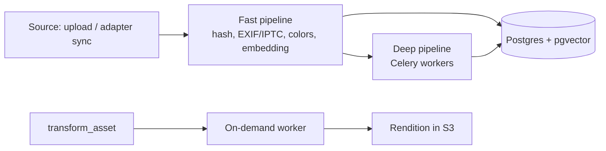
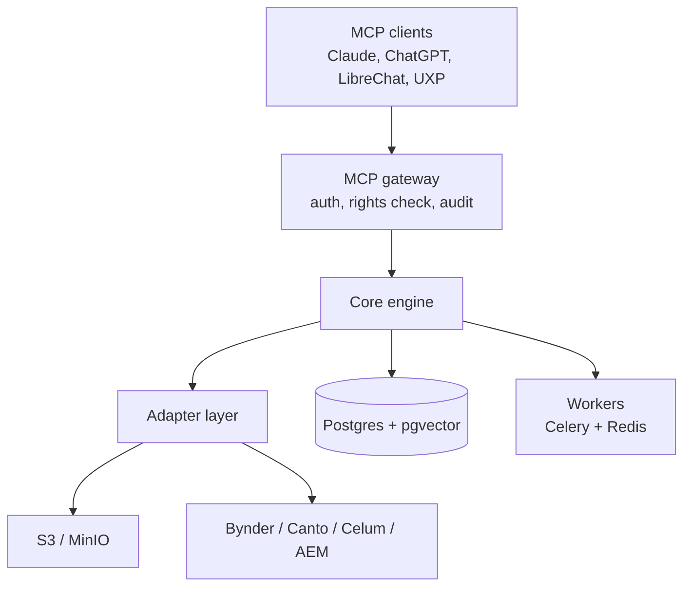

# OpenAgenticDAM — Product Requirements Document

Sep 22, 2026

> **Language note:** This is the English reference version. The German original is kept at
> [`PRD.de.md`](PRD.de.md). If the two diverge, the German document is authoritative until
> stated otherwise.

## Document status

Draft v0.9, consolidated from Master Plan v1.0.0, the README and a market/architecture note.
Contradictions between those sources are resolved here.

| Field | Value |
| --- | --- |
| Project | OpenAgenticDAM |
| Repository | [github.com/OpenAgenticDAM](https://github.com/OpenAgenticDAM) (org exists, confirm ownership) |
| License | Apache 2.0, open core |
| Audience of this document | Architects, developers, enterprise IT, marketing ops, investors |
| Status | Draft, problem validation pending |

## Executive summary & vision

OpenAgenticDAM is an open-source, rights-aware MCP layer that makes media assets in existing
stores and DAMs searchable and editable through natural language — without migration.

Users drive search, metadata and transformations through MCP clients such as Claude Desktop,
ChatGPT or LibreChat. There is no dedicated web dashboard; a minimal review view is rendered
inside the client via MCP apps.

The system runs in two modes: as an **overlay** in front of S3/MinIO and commercial DAMs
(Bynder, Canto, Celum, AEM), and as a **standalone** DAM with its own storage. The overlay is
the core product; standalone is the entry point for developers.

## Vision, mission & why

**Vision:** Every media asset a company owns is findable and usable by humans and AI agents,
no matter which system holds it. Language becomes the interface to all media.

**Mission:** We build the open, rights-aware MCP layer that makes existing media libraries
agent-ready without migration: self-hostable, vendor-neutral and demonstrably compliant.

**Why does OpenAgenticDAM need to exist? (5 whys)**

1. **Why?** Companies cannot find their assets efficiently, and AI agents have no access to them at all.
2. **Why?** Assets sit in silos (several DAMs, S3, agencies), and search depends on manually maintained tags that are full of gaps.
3. **Why don't the DAM vendors solve this?** Each vendor retrofits AI only inside its own system. Cross-system search and open agent access contradict their lock-in model.
4. **Why not just migrate everything into one system?** Migration is expensive, risky and takes years. Rights, workflows and integrations are tied to the existing systems.
5. **Why now, and why open?** Agents are becoming the new work surface via MCP. A layer that sees all of a company's media needs maximum trust: auditable code, self-hosting, rights enforcement and audit trails. Only open source delivers that credibly.

**Root cause:** There is no neutral, trustworthy access layer between AI agents and distributed
media repositories. That is exactly the gap OpenAgenticDAM fills.

This chain rests on assumptions that must be confirmed in customer interviews — point 3 above all.

## Problem & target groups

Companies have assets spread across several DAMs and stores, search only works through manually
maintained tags, and no source is accessible to AI agents.

- **Search fails on missing metadata:** Images without tags or with inconsistent taxonomy are effectively unfindable.
- **Silos:** Marketing, product and agencies work in different systems with no shared search.
- **Agents without access:** LLM workflows cannot find, check and deliver assets in a rights-compliant way.
- **Compliance pressure:** AI-generated content must be labelled (EU AI Act Art. 50), provenance must be demonstrable.

| Persona | Role | Core need |
| --- | --- | --- |
| Content ops manager | maintains assets in an enterprise DAM | cross-system search, metadata enrichment without manual work |
| Enterprise architect | owns the DAM/CSC landscape | AI layer without migration, rights and audit handled cleanly |
| Creative / designer | works in Photoshop, Premiere | find an asset and export it in the right format without leaving the tool |
| Developer / self-hoster | builds their own agent workflows | self-hosted MCP media engine with an open API |

**Open:** The problem is not yet validated with customers; the target is 3–5 interviews before v0.2.

## Benefits: which pain points OpenAgenticDAM removes

OpenAgenticDAM makes existing media libraries findable, agent-ready and demonstrably compliant
without migration. The effects below are hypotheses and will be measured in the pilot.

| Pain point today | Solution through OpenAgenticDAM | Benefit |
| --- | --- | --- |
| Assets with no or poor tags are unfindable | Automatic embeddings, captions, OCR and transcripts at ingestion | Search by image content instead of tags; no manual re-tagging |
| Assets are spread across several DAMs and stores | One adapter layer, one search across all sources | One query instead of searching three systems |
| Retrofitting AI requires migration into a new DAM | Overlay in front of existing systems, originals stay in the source system | No migration project, no vendor switch, fast start |
| DAM interfaces are complex, occasional users get lost | Operation through natural language in the familiar chat client | No training, self-service for marketing, sales, agencies |
| Variants (formats, sizes, crops) are created manually in Photoshop | `transform_asset` with deterministic workers | Renditions by sentence instead of by ticket to the design team |
| Video content is not searchable | Scene detection, keyframe embeddings, transcription | Find individual scenes and spoken content directly |
| AI agents have no rights-compliant access to assets | MCP tools with ACL enforcement from the source system | Agent workflows without rights or data leaks |
| Usage rights and expiry dates get overlooked | Rights as search filters, warning on expired licences | Fewer licence violations and less legal exposure |
| AI labelling (EU AI Act Art. 50) is manual and patchy | Detection, labelling and C2PA manifests as standard | Demonstrable compliance without an extra tool |
| No traceability of AI changes | Audit log of every tool call in the open core | Auditability for IT and legal |
| Proprietary AI add-ons are expensive and lock you in | Apache 2.0, self-hostable, local models | Data sovereignty, no per-seat licences, marginal cost near zero |
| Creatives constantly switch between tool and DAM | UXP panel in Photoshop and Premiere (later) | Find and use assets without a context switch |

**Benefit by target group**

- **Content ops:** less maintenance effort, because metadata is generated automatically and applies across all sources.
- **Enterprise architecture:** AI capability for the existing DAM landscape without migration, with rights, audit and compliance evidence.
- **Creatives:** find assets by sentence and receive them in the format they need, without the DAM interface.
- **Developers:** an open, self-hostable media engine as a building block for their own agent workflows.

## Market & competition

The DAM market is growing strongly, but the large vendors now ship their own AI agents and in
some cases their own MCP servers. The remaining gap is the cross-system, self-hosted layer.

**Market size:** Estimates for 2026 range between USD 6.29bn and 8.69bn worldwide, at 15–18 %
annual growth; Europe held roughly 26 % share in 2025
([Fortune Business Insights](https://www.fortunebusinessinsights.com/digital-asset-management-dam-market-104914),
[Research and Markets](https://www.researchandmarkets.com/reports/5767251/digital-asset-management-market-report)).
According to [Mordor Intelligence](https://www.mordorintelligence.com/industry-reports/digital-asset-management-dam-market),
vendors are evolving from storage repositories into orchestration layers; semantic search is
becoming a baseline requirement.

| Vendor / project | Type | AI / MCP status (Sep 2026) | Gap for us |
| --- | --- | --- | --- |
| [Adobe AEM Assets](https://experienceleague.adobe.com/en/docs/experience-manager-cloud-service/content/ai-in-aem/mcp-support/using-mcp-with-aem-as-a-cloud-service) | commercial DAM | official MCP server with asset search, upload, metadata, renditions | AEM only, Cloud Service only |
| [Bynder](https://www.bynder.com/en/) | commercial DAM | AI agents inside the platform; per competitor [Masset](https://www.getmasset.com/compare/masset-vs-bynder), no native MCP for the core DAM | no agent access from outside |
| [Frontify](https://www.frontify.com/en/guide/bynder-alternatives) | brand/DAM platform | own MCP server for brand knowledge and assets | own system only |
| CI HUB | commercial connector | MCP bridge to enterprise DAMs | paid, no vector search of its own |
| Pimcore/OpenDXP, AtroDAM, ResourceSpace | open-source DAMs | UI-centric, not agent-native | no MCP-first approach |
| Immich, PhotoPrism | open-source photo management | good CLIP search | consumer focus, no rights model |

**Market gap:** vector search across all source systems, a unified rights and audit model, and
self-hosting. Individual vendor MCPs only solve "AI inside my own system".

**Consequence:** The first commercial adapter is Bynder (large installed base, no native MCP),
not AEM (Adobe ships its own).

## Positioning & product principles

**Positioning:** "The open, rights-aware MCP search layer for all of a company's media."
Enterprise first, the self-hosting community as a distribution channel, SMB SaaS later.

1. **Adapter-first:** No customer has to migrate. Every feature works against source systems through a unified adapter layer.
2. **Chat-first, no dashboard:** Every feature is a typed, deterministic MCP tool. Previews and approvals run as image responses or MCP apps in the client.
3. **Rights before relevance:** No search hit the user would not be allowed to see in the source system.
4. **The LLM decides, workers execute:** The model picks tool and parameters; libvips, FFmpeg and Trimesh execute deterministically.
5. **Local-first on cost:** Routine tasks on local models, cloud APIs only for complex cases.
6. **Compliance is core, not an add-on:** Audit log, AI labelling and content credentials (C2PA) are part of the open core.

## Scope

The MVP is read-only: find and view assets from S3 and one commercial DAM in a rights-compliant
way. Write capabilities follow afterwards.

**MVP (v0.1–v0.2)**

- S3/MinIO adapter and one commercial DAM adapter (Bynder; AEM has its own MCP server)
- Fast ingestion: hash, EXIF/IPTC, colour palette, image embeddings
- `search_assets`, `get_asset_details`, `list_sources`
- ACL enforcement from the source system, audit log of every tool use
- Thumbnail preview as an image response in chat

**Later (v0.3+)**

- Deep pipeline: OCR, captioning, video scenes, transcription, 3D preview
- Write tools: upload, metadata, transformation, collections
- AI labelling and C2PA, further adapters, Adobe UXP panel
- Enterprise: SSO/SAML, granular RBAC, multi-tenancy, managed cloud

**Non-goals**

- No web dashboard of our own
- No replacement for DAM workflows such as approval chains, brand portals or PIM
- No generative image creation
- No write-back into source DAMs in the MVP

## Functional requirements: MCP tools

Nine tools cover the lifecycle; three of them form the MVP. Write tools support `dry_run` and
require confirmation for destructive operations.

| Tool | Parameters | Function | Phase |
| --- | --- | --- | --- |
| `search_assets` | `query`, `mode` (keyword/semantic/hybrid), `filters`, `sources`, `limit` | hybrid search, rights-compliant hits only, thumbnails as image responses | MVP |
| `get_asset_details` | `asset_id` | EXIF, rights, AI captions, OCR, transcript, source-system link | MVP |
| `list_sources` | – | connected source systems and sync status | MVP |
| `request_upload` | `file_name`, `mime_type`, `collection?` | pre-signed URL for direct upload | v0.3 |
| `upload_asset_via_url` | `url`, `collection?`, `tags?` | ingest an asset from a web source | v0.3 |
| `edit_asset_metadata` | `asset_id`, `tags`, `description`, `dry_run?` | change metadata, with audit entry | v0.3 |
| `transform_asset` | `asset_id`, `operations`, `dry_run?` | scale, crop, format, trim, watermark; result as a new rendition | v0.3 |
| `manage_collections` | `action`, `collection`, `asset_ids` | create and maintain collections | v0.4 |
| `label_ai_content` | `asset_id`, `method` | write AI labelling and C2PA manifest | v0.4 |

**Requirements for all tools:** typed JSON schemas, stable error codes, pagination, bounded
response size (assets never as full files, only thumbnail or pre-signed URL).

## Ingestion & processing

Every asset passes through a fast pipeline (target < 3 s per image) for searchability and an
asynchronous deep pipeline for content understanding.



In overlay mode the adapter delivers assets via webhook or polling; the original stays in the
source system, and only metadata, embeddings and thumbnails are stored.

| Medium | Deep analysis | On-demand processing | Stack |
| --- | --- | --- | --- |
| Images | OCR, captioning, VLM analysis | smart crop, scaling, WebP/CMYK, watermark | PaddleOCR, local VLM, libvips, Pillow |
| Video | scenes, keyframes (each with its own embedding), transcription | stream-copy trim, H.264/WebM, burned-in subtitles | PySceneDetect, faster-whisper, FFmpeg |
| 3D | offscreen rendering, mesh validation | decimation, STL → glTF | Trimesh, Open3D, PyOpenGL |
| Documents | text extraction, page thumbnails | – | pypdf/pdfplumber |

Model choice (VLM, embedding) will be decided before v0.2 by benchmarking on customer data;
candidates are current Qwen-VL and SigLIP-2-class models, with licences checked per model.

## Architecture & tech stack

Three layers: MCP gateway as the control plane, core engine with adapter layer, and storage plus
asynchronous workers.



| Component | Choice | Rationale |
| --- | --- | --- |
| Language / API | Python 3.11+, FastAPI, official MCP Python SDK | mature SDK, native ML and media libraries |
| Transport | MCP over stdio (local) and Streamable HTTP (server) | desktop clients and remote operation |
| Database | PostgreSQL + pgvector | relations, rights and vectors in one system |
| Storage | S3-compatible (MinIO, AWS S3) | pre-signed URLs instead of streaming through the server |
| Queue | Celery + Redis (alternative: ARQ) | established, scales horizontally |
| LLM routing | Ollama local, cloud APIs as fallback | marginal cost near zero for routine tasks |
| Packaging | uv, Docker Compose, Helm chart later | fast local start, Kubernetes for enterprise |

## Data model

The original single-table schema is split so that tenants, source systems, rights, versions and
multiple embedding models can be represented.

```sql
CREATE TABLE sources (
  id UUID PRIMARY KEY DEFAULT gen_random_uuid(),
  tenant_id UUID NOT NULL,
  kind TEXT NOT NULL,              -- s3, bynder, aem ...
  config JSONB NOT NULL,
  last_sync_at TIMESTAMPTZ
);

CREATE TABLE assets (
  id UUID PRIMARY KEY DEFAULT gen_random_uuid(),
  tenant_id UUID NOT NULL,
  source_id UUID NOT NULL REFERENCES sources(id),
  external_id TEXT NOT NULL,       -- ID in the source system
  hash_sha256 CHAR(64) NOT NULL,
  file_name TEXT NOT NULL,
  mime_type TEXT NOT NULL,
  file_size_bytes BIGINT NOT NULL,
  title TEXT, description TEXT, tags TEXT[] DEFAULT '{}', creator TEXT,
  technical_metadata JSONB NOT NULL DEFAULT '{}',
  ai_metadata JSONB NOT NULL DEFAULT '{}',
  deleted_at TIMESTAMPTZ,
  created_at TIMESTAMPTZ DEFAULT now(), updated_at TIMESTAMPTZ DEFAULT now(),
  UNIQUE (source_id, external_id)
);

CREATE TABLE asset_rights (
  asset_id UUID REFERENCES assets(id),
  license TEXT, channels TEXT[], regions TEXT[],
  valid_from DATE, valid_until DATE,
  ai_generated BOOLEAN, c2pa_manifest JSONB
);

CREATE TABLE asset_acl (
  asset_id UUID REFERENCES assets(id),
  principal TEXT NOT NULL,         -- user/group from the source system
  permission TEXT NOT NULL
);

CREATE TABLE asset_versions (
  id UUID PRIMARY KEY DEFAULT gen_random_uuid(),
  asset_id UUID REFERENCES assets(id),
  kind TEXT NOT NULL,              -- original, rendition, thumbnail
  storage_path TEXT NOT NULL, params JSONB
);

CREATE TABLE embeddings (
  asset_id UUID REFERENCES assets(id),
  segment TEXT NOT NULL DEFAULT 'full', -- or keyframe/scene:<n>
  model TEXT NOT NULL,             -- e.g. siglip2-base@v1
  embedding vector(768) NOT NULL,
  PRIMARY KEY (asset_id, segment, model)
);
CREATE INDEX ON embeddings USING hnsw (embedding vector_cosine_ops);

CREATE TABLE audit_log (
  id BIGSERIAL PRIMARY KEY, tenant_id UUID, actor TEXT, client TEXT,
  tool TEXT, params JSONB, asset_ids UUID[], at TIMESTAMPTZ DEFAULT now()
);
```

Changes versus the Master Plan: the hash is no longer globally unique (the same file can live in
several sources), embeddings are versioned and per video segment, and rights and ACL are their
own tables. The vector dimension depends on the chosen model.

## Security, rights & compliance

Rights enforcement in overlay mode is the product's most important requirement: semantic search
must never show more than the source system.

- **ACL mirroring:** Permissions are taken over per asset during sync and applied as an SQL filter before vector ranking on every search. Unclear rights mean the asset is not visible (fail closed).
- **Identity:** The user is authenticated at the gateway via OAuth and mapped to principals of the source systems.
- **Prompt injection:** OCR text, captions and transcripts are foreign content. They are marked as data in tool responses and never phrased as instructions to the LLM.
- **Destructive actions:** `dry_run` and explicit confirmation for delete, overwrite and bulk changes.
- **Audit log:** Every tool call with user, client, parameters and affected assets. Part of the open core, not the enterprise licence.
- **AI labelling:** Detection and labelling of AI-generated assets, reading and writing C2PA manifests (EU AI Act Art. 50).
- **Privacy:** Local-first models by default; cloud APIs only per-tenant opt-in, with no transmission of personal image content without approval.
- **Secrets:** Credentials only via environment variables or a secret store, no default credentials in example configurations.

## Non-functional requirements

Target values for the MVP; all values are assumptions and will be calibrated in the pilot.

| Area | Requirement |
| --- | --- |
| Search latency | p95 < 800 ms at 1M assets per tenant |
| Fast ingestion | < 3 s per image, ≥ 50,000 images/hour on one GPU worker |
| Scale | 10M assets per installation, horizontally scaling workers |
| Sync freshness | rights and deletion changes from the source system visible ≤ 15 min |
| Availability | 99.5 % (managed cloud), no SLA when self-hosted |
| Portability | operation without a GPU possible (CPU embeddings, reduced deep pipeline) |
| Observability | OpenTelemetry traces per tool call, Prometheus metrics |
| Quality | search quality measurable via Recall@10 on a customer test set |

## Deployment & hardware

Three tiers; costs are orientation values from the Master Plan and must be verified with hosters.

| Tier | Purpose | Specification | Cost (€/month) |
| --- | --- | --- | --- |
| Development | local development, tests | 4 vCPU, 16 GB RAM, 100 GB NVMe | 15–25 |
| Mid-tier | overlay operation, fast ingestion | 8 vCPU, 32 GB RAM, NVMe RAID | 40–80 |
| GPU worker | deep pipeline (VLM, Whisper) | 8+ cores, 64 GB RAM, 1 GPU with 20–24 GB VRAM | 180–300 |

For datacenter operation, plan for workstation or datacenter GPUs; NVIDIA's driver licence
restricts GeForce cards (RTX 3090/4090) there.

Local start: `docker compose up` (Postgres, Redis, MinIO), `uv sync`, `alembic upgrade head`,
then start the worker and MCP server and register it in `claude_desktop_config.json`.

## Business model & pricing

The money is in the enterprise business: pilots and services fund the start, annual self-hosting
licences form the recurring revenue. All prices are assumptions and must be validated in the
design-partner pilots.

| Revenue source | Model | Price assumption | Phase |
| --- | --- | --- | --- |
| Design-partner pilot | fixed-price PoC, 8–12 weeks, in exchange for a case study | €15–30k | immediately |
| Enterprise licence (self-hosted) | annual subscription, tiered by asset volume and connected sources; incl. SSO, RBAC, multi-tenancy, support SLA | €30–80k/year | from v0.5 |
| Commercial adapters | Bynder, Celum, Canto etc.; S3/MinIO stays open source | in the enterprise package | from v0.2 |
| Compliance pack | audit reports for auditors, C2PA signing with customer keys, retention rules | 20–30 % surcharge | from v0.4 |
| Services | onboarding, custom adapters, fine-tuning vision models on customer products | day rates | from first customer |
| Partner channel | revenue share for systems integrators | 20–30 % | from v0.5 |
| Managed cloud | usage-based: assets + processing minutes | per cost model | from v1.0 |
| UXP panels | Photoshop/Premiere chat panel, per-user subscription | open | after market validation |

The base audit log stays open core; what is sold is evaluation and assurance for auditors. The
Master Plan goal of "SaaS from $29/month" is dropped: it does not cover GPU costs of €180–300
per worker.

## Commercialisation & go-to-market

OpenAgenticDAM sells first to large corporates and regulated organisations in the DACH region
with multiple DAMs; the open-source community serves as a distribution and trust channel, not a
revenue source.

**Target segments**

| Segment | Profile | Buyer | Reason to buy |
| --- | --- | --- | --- |
| Primary: corporates with multi-DAM landscapes | automotive, consumer goods, retail, media; several DAMs plus agency storage | Head of Content Ops / MarTech, CIO | one search across all systems, AI without migration |
| Primary: regulated and sovereignty-sensitive organisations | public sector, pharma, finance, industry in DACH | IT leadership, data protection, compliance | self-hosting, local models, audit, AI labelling |
| Secondary: systems integrators and agencies | DAM/AEM partners, creative agencies with many customer libraries | practice lead | their own AI offering, services revenue |
| Funnel: developers and self-hosters | build agent workflows | not a buyer | distribution, adapter contributions, visibility |

SMBs are deliberately not a target segment: they rarely run several DAMs, and willingness to pay
does not match the GPU costs.

**Core message:** "Your AI finds every asset, in every system, rights-compliant, without migration."

**Marketing phases**

1. **Community-first (v0.1–v0.2):** GitHub launch with a demo video (one sentence searching S3 and Bynder at once), listings in MCP registries, launch posts on Hacker News, Reddit and LinkedIn.
2. **Thought leadership:** positioning around content supply chain and AI compliance; whitepaper on AI labelling under EU AI Act Art. 50 in the DAM context; talks at DAM and MarTech conferences; the CSC book as a credibility anchor.
3. **Design-partner programme:** three pilot customers at a reduced price in exchange for a case study and reference; the first enterprise licences grow out of these.
4. **Partner channel:** two to three systems integrators from the DAM/AEM space with revenue share; they bring customer access.

**Biggest commercial risk:** If all major DAM vendors ship usable MCP servers, customers can
simply attach them to their agents in parallel. The value must then come from shared vector
search, a unified rights/audit model and self-hosting. That is the first hypothesis for the
customer interviews.

## Branding & name protection

The name OpenAgenticDAM stays; commercial offerings run under the same brand
("OpenAgenticDAM Cloud", "OpenAgenticDAM Enterprise") rather than a second brand
"OpenAgentic Cloud".

| Channel | Name | Status (checked 22 Sep 2026) |
| --- | --- | --- |
| GitHub | `OpenAgenticDAM`, repo `Core` | exists, confirm ownership |
| PyPI | `openagenticdam`, `openagenticdam-mcp` | available |
| npm | `openagenticdam`, `openagenticdam-mcp` | available |
| Domains | .com, .org, .io, .dev, .ai | no DNS record, confirm via WHOIS |
| Trademark | "OpenAgentic" classes 9, 42 | check DPMA, EUIPO, USPTO |

- [ ] Reserve PyPI and npm names as placeholders
- [ ] Register .com and .dev domains
- [ ] Trademark search before public launch

## Roadmap

The order now follows the adapter-first strategy: adapters and rights come before write tools
and plugins. Timelines are omitted until team and capacity are fixed.

| Version | Content | Exit criterion |
| --- | --- | --- |
| v0.1 | MCP gateway, data model, S3/MinIO adapter, fast ingestion, `search_assets`, `get_asset_details`, audit log | search across 100,000 test assets from Claude Desktop |
| v0.2 | first commercial DAM adapter with ACL sync, `list_sources`, thumbnail responses | pilot at one customer, no rights violation in testing |
| v0.3 | deep pipeline (OCR, captions, video, Whisper), write tools with `dry_run` | Recall@10 measurably better than the source system's tag search |
| v0.4 | AI labelling/C2PA, collections, 3D pipeline, second DAM adapter | one compliance workflow live in a pilot |
| v0.5 | SSO/SAML, granular RBAC, multi-tenancy, Helm chart | first paying enterprise customer |
| v1.0 | managed cloud, UXP panel (after market validation) | stable per-asset pricing |

The README claim that "v0.1 and v0.2 are done" is corrected until code in the repository proves
otherwise.

## Success metrics

Success is measured by search quality, rights safety and pilot customers — not by GitHub stars.

| Metric | Target |
| --- | --- |
| Recall@10 versus the source system's tag search | +30 % on a customer test set |
| Rights violations in search results | 0 |
| Time to first search result after installation | < 30 min |
| Pilot customers with a commercial DAM adapter | 3 by v0.5 |
| Share of successful tool calls without a follow-up question | > 90 % |
| Community | active external contributors, third-party adapters |

## Risks & open questions

The biggest risk is not technical — it is that the DAM vendors ship the same AI layer themselves.

| Risk | Impact | Mitigation |
| --- | --- | --- |
| DAM vendors build their own AI search and MCP servers | overlay loses its value | cross-vendor search and compliance as differentiation |
| Faulty ACL mirroring | data leak, fatal in enterprise | fail closed, rights tests as a release gate |
| Egress costs and rate limits of source APIs | initial sync expensive and slow | thumbnail sync instead of originals, throttled backfill |
| Zero-UI deters DAM buyers | sales obstacle | review view via MCP apps, demo workflows |
| Model licences and model ageing | legal risk, degrading quality | licence review per model, versioned embeddings |
| Prompt injection via asset content | agent takes wrong actions | mark content as data, confirmation on write access |

- [ ] Confirm Bynder as the first adapter in the interviews
- [ ] Validate price assumptions (pilot €15–30k, licence €30–80k/year) with design partners
- [ ] Build a cost model per 100,000 assets
- [ ] Run 3–5 customer interviews
- [ ] Fix team and schedule for v0.1–v0.2; clarify founders' side-activity and IP questions

## Sources

Research as of 22 Sep 2026. Competitive data taken from vendor and competitor pages; verify
before investor conversations.

- [Fortune Business Insights: DAM Market Size 2026–2034](https://www.fortunebusinessinsights.com/digital-asset-management-dam-market-104914)
- [Research and Markets: Digital Asset Management Market Report 2026](https://www.researchandmarkets.com/reports/5767251/digital-asset-management-market-report)
- [Mordor Intelligence: DAM Market 2026–2031](https://www.mordorintelligence.com/industry-reports/digital-asset-management-dam-market)
- [Adobe Experience League: Using MCP with AEM as a Cloud Service](https://experienceleague.adobe.com/en/docs/experience-manager-cloud-service/content/ai-in-aem/mcp-support/using-mcp-with-aem-as-a-cloud-service)
- [Bynder: AI Agents product page](https://www.bynder.com/en/)
- [Masset: Masset vs. Bynder (competitor comparison, partisan)](https://www.getmasset.com/compare/masset-vs-bynder)
- [Frontify: Bynder alternatives incl. Frontify MCP](https://www.frontify.com/en/guide/bynder-alternatives)
